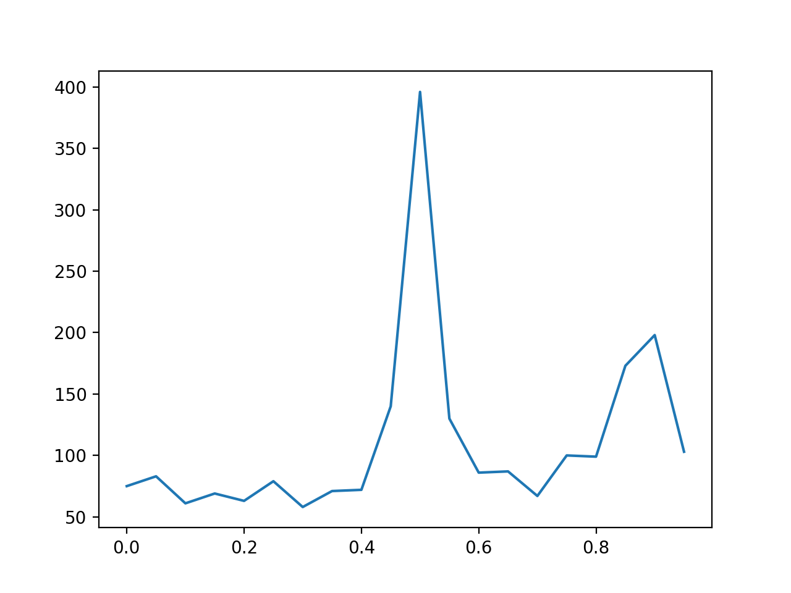

# fermi_timing_pipeline

A pipeline program downloads the weekly LAT photon and spacecraft files and searches for periods, calculates TOA.

## configure YAML file

YAML is a human-readable data serialization standard that can be used in conjunction with all programming languages and is often used to write configuration files.
Here is an example of YAML file:

```
data:                                                                                                                                                                                                                         
  evfile   : "data/lat_photon_weekly_w637_p305_v001.fits"
  scfile   : "data/lat_spacecraft_weekly_w637_p202_v001.fits"
  gtselect : "data/weekly_w637_p305_v001_gtselect.fits"
  gtbary   : "data/weekly_w637_p305_v001_gtbary.fits"

selection :
  emin     : 100
  emax     : 316227.76
  zmax     : 90
  evclass  : 128
  evtype   : 3
  tmin     : null
  tmax     : null
  rad      : 5
  filter   : null

parameters:
  PEPOCH :    48442.5
  F0     :    29.946923
  F1     :    -3.77535E-10
  F2     :    1.1147E-20
  F3     :    -2.73E-30
  FRANGE :    1.0e-3
  FSTEP  :    1.0e-8
  PSRJ   :    J0534+2200
  PSRB   :    B0531+21
  NAME   :    B0531+21
  RAJ    :    05:34:31.973
  DECJ   :    +22:00:52.06
  ```
  
* parameter ```data``` sets the file name of Fermi GTAnalyse processes. If evfile or scfile does not exists, 
the program will try to retrieve a file with that assigned name from FTP server https://heasarc.gsfc.nasa.gov/FTP/fermi/data/lat/weekly/photon/.

* parameter `selection` sets the filter parameters in Fermi GTAnalyse processes. (Only gtselect and gtbary are executed)

* parameter `parameters` are the timing parameters for searching the frequency.

The program is run using the above configure file with the following results (take Crab pulsar for example):
```
./timing_pipeline.py
Checking file --> data/lat_photon_weekly_w637_p305_v001.fits not exists
Retrieving file --> data/lat_photon_weekly_w637_p305_v001.fits
100% [....................................................................]   193098240 / 193098240
Checking file --> data/lat_photon_weekly_w637_p305_v001.fits exists
100% [..........................................................................] 2652480 / 2652480
Executing --> gtselect infile=data/lat_photon_weekly_w637_p305_v001.fits outfile=data/weekly_w637_p305_v001_gtselect.fits ra=83.63322083333333 dec=22.01446111111111 rad=5 tmin=618970654.085725 tmax=619573904.0101355 emin=100 emax=316227.76 zmax=90
Executing --> gtbary evfile=data/weekly_w637_p305_v001_gtselect.fits scfile=data/lat_spacecraft_weekly_w637_p202_v001.fits outfile=data/weekly_w637_p305_v001_gtbary.fits ra=83.63322083333333 dec=22.01446111111111
Fsearch --> data/weekly_w637_p305_v001_gtbary.fits
```
## fsearch results:



